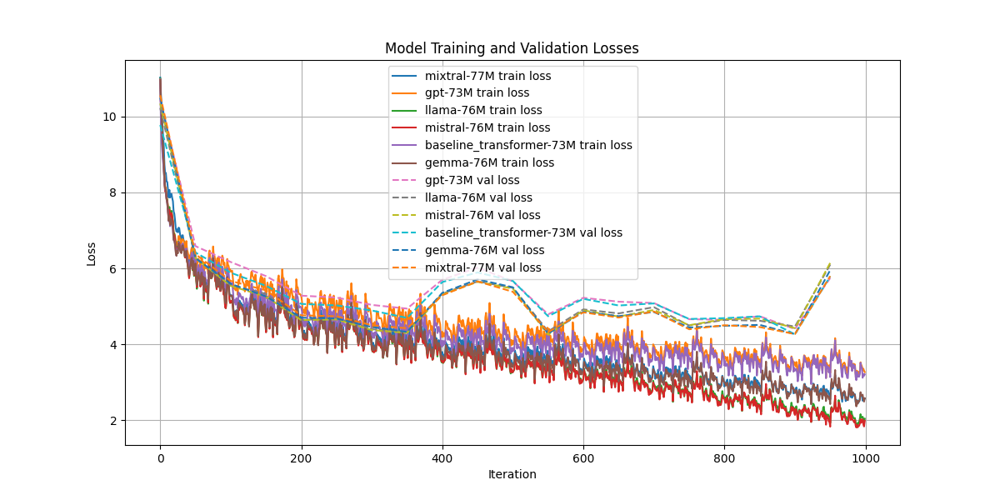

# mini-llm-brawl
Implementing tiny versions of current state-of-art llms and comparing them on simple task

## Training
With train.py you can train different models or different hyperparameter settings

You can change the hyperparamers for different models from models/model_name.py 

### train all available models
```bash
python3 train.py --model_params=[n_params]
```

### train single model
```bash
python3 train.py [model_name] --model_params=[n_params]
```
### train single model with different hyperparameters
```bash
python3 train.py [model_name] --tune --model_params=[n_params]
```

at the moment only 50M, 75M and 100M param models are supported

## Comparision
See the training graph of training run 

### latest run
```bash
python3 compare.py
```
### specific run
```bash
python3 compare.py [run_name]
```

## shakespare dataset - 75M models

